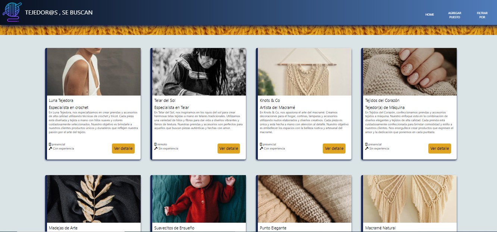

# Weavers-Wanted
***
This project is made to be evaluated in the final instance of module 4, to Fronted Development career, dictated by the institution ADA. This project is based on the creation of a web page for the application and job search of professional weavers, with the knowledge acquired in the course of module 3 about javascript. To carry out this project HTML was used, the Tailwind framework was used for CSS and Javascript
***
**¡Here you can see the Weavers-Wanted web page!** Click here [aquí](florencia-navarro.github.io/weavers-wan)
***
## Web page sections
- **HEADER:** In the mobile version you will find the burger-menu where you will find the buttons that will direct you to the form to add a job application; and the filters to apply between all these. And in the desktop version there are the buttons that will direct you to home, to the form to add applications and the filters that can be applied.
- **MAIN SECTION:** In the central section you can see the cards that show us each of the applications with an image, a description of the required work and a button that will send another card with more details about it.
- **CARD DETAIL:** In this card we can see a greater description of each application. The activity carried out by each company, the characteristics and requirements requested for each job and the benefits offered for each job position. In addition to a representative image. In the lower section there are two buttons that will take us to the form to edit the information or to delete the application. 
- **FORM TO ADD APPLICATION:** In this form you must complete the necessary inputs to make an application. Data such as company names and job titles, representative image, characteristics related to the workplace, required experience, approximate salary, and benefits of health coverage and raw materials. This same form will also serve us to edit any job that we have already applied for.
This is how it should look when you enter

***

My thanks to the teacher for the help and good energy.

 17va Frontend Online
 ADA

 Made with love 🖤 by Florencia Navarro